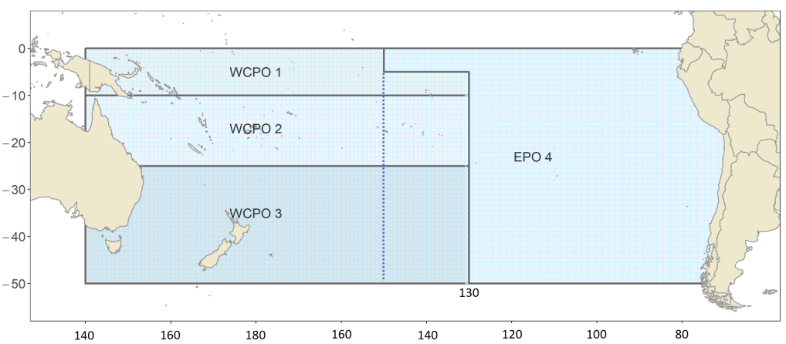
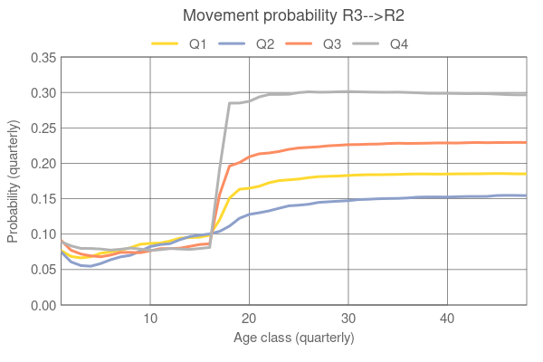

# SEAPODYM R tools: SEAMOVE library

R library to extract SEAPODYM movement fluxes (biomass flow rate) from donor to recepient region as a result of seapodym\_fluxes simulation with specific regional structure, and to convert them to the seasonal movement probabilities to be used in Multifan-CL. The regional and age structure of Multifan-CL should be defined in the SEAPODYM configuration (XML parfile) for the simulation.

## About

Package: seamove
Version: 0.0
Title: Reading and visualizing SEAPODYM regional fluxes as well as exporting them in the Multifan-CL format.
Author: Inna Senina <innas@spc.int>
Maintainer: Inna Senina <innas@spc.int>
Depends: R (>= 1.0.0)
Description: This small package provides functions to read outputs of seapodym\_fluxes application, from a single or multiple simulations, plot them and to export them in the format used by Multifan-CL, i.e. as seasonal movement probabilities for a given age and regional structure.

## Installation

Method #1. 

1. In command line outside of downloaded package directory (Linux only)

   CMD build seamove

2. From pkg.tar.gz file, in command line (prompt in Windows)

   R CMD INSTALL seamove\_0.0.tar.gz

   Note, in Windows install the Rtools package to enable the installation from tar.gz

Method #2. With R devtools package, in R environment (no need to build first)

   library(devtools)
   devtools::install\_github("[path]/seapodym/rtools/seamove")

## Algorithm

For the algorithm to compute the biomass flow rates between regions, see the Reference Manual of the SEAPODYM model. This document provides the definition of the SEAPODYM fluxes as well as the method to convert them to the movement probabilities that can be used by the Multifan-CL stock-assessment model. 

**Biomass fluxes in SEAPODYM**

Let $B_{a,t,x,y}$ be the biomass density (in mt/km$^2$) of tuna population at age $a=1,...,A+$, time $t$ and grid cell $(x,y)$.
Let's consider two regions, $r_1$ and $r_2$. For a given age $a$, we denote 

$$
\beta_{r_1,r_2}=\sum_{i,j \in r_2} B_{t+\Delta t,x,y} \cdot \textsc{A}_{xy}, \mbox{ when } B_{t,x,y} \mbox{ } \forall x,y \in r_1 \mbox{ at time } t,
$$

where $\textsc{A}_{xy}$ is the grid cell surface area in km$^2$. Hence, we say $\beta_{r_1,r_2}$ is the total regional biomass moving from region $r_1$ to region $r_2$ during time period $(t,t+\Delta t)$.

For a given age $a$ and $n$ regions we have $n \times n$ matrix with all elements corresponding to the same time $t+\Delta t$:
$$
  \mathbf{F}_{t,a}=\left(
    \begin{array}{cccc}
      \beta_{1,1} & \beta_{1,2} & \ldots &  \beta_{1,n}\\
      \beta_{2,1} & \beta_{2,2} & \ldots &  \beta_{2,n}\\
      \vdots      & \vdots      & \vdots &  \vdots     \\
      \beta_{n,1} & \beta_{n,2} & \ldots &  \beta_{n,n}
    \end{array}
  \right),
$$

where the $\sum_{j} \beta_{i,j}$ is the total biomass that was in region $i$ before the movement occurred, i.e., at time $t$, and the $\sum_{i} \beta_{i,j}$ is the biomass in region $j$ after the movement occurred, i.e., at time $t+\Delta t$. In other words, 

\begin{itemize}
 \item[] $\sum_{j!=i} \beta_{i,j}$ -- \textbf{outgoing biomass} from region $i$ to other regions, 
 \item[]$\sum_{i!=j} \beta_{i,j}$ -- \textbf{incoming biomass} to region $j$ from other regions, and 
 \item[] $\beta_{ii}$ -- the \textbf{resident biomass} that stayed in the region $i$ during the time period $(t,t+\Delta t)$. 
\end{itemize}

As seen from above, the elements of matrix $\mathbf{F}_{t,a}$ have units of mass flow rate, i.e., mt/$\Delta t$. In current SEAPODYM implementation, $\Delta t$ is set to 3-months period, hence $\beta_{ij}$ units are mt/qtr. 

A simulation with {\ttfamily seapodym\_fluxes} application computes $n_a \times n_t$ of $n \times n$ matrices, written in $n_a$ ASCII files and named {\ttfamily spname\_FluxesRegion\_age[a-1].txt}.

## Examples 

Simulations of seapodym\_fluxes were run with the following regional structure specified in the XML parfile.

The simulation directory `ALB.DIR` contains the folder `output` with alb\_FluxesRegion\_age[a].txt.

  `dir.in <- paste0(ALB.DIR,"/output/")`
  `dir.out<-paste0(ALB.DIR,"/output-mfcl/")`

Let's run the main function handling all necessary steps to extract, convert the units and plot the resulting movement probabilities as computed for the Multifan-CL model:

  `sea2mfcl.movement(dir.in,dir.out,1979:2010,age.in=5:148,age.plus=FALSE,aggregate.age=3,nbr.in=4)`

In this example, the monthly age classes starting from age class 5 (sixth age class with mean age 5.5 months, the information provided in the outputs) till age class 148 of SEAPODYM (the value of age.plus=FALSE indicates that this is not an A+ class) will be aggregated to quarterly resolution (parameter `aggregate.age=3`), resulting in 48 age classes. The routine will write the movement-matrices-for-MFCL.txt file as well as plot the results as shown on the figure below for the movement from region 3 to region 2.

The corresponding Multifan-CL file has the following format (showing the first and the last, 48th, matrices):

`# movement matrices` \\
`# Movement period  1  age class  1` \\
`0.838916915     0.0656896789    4.21166e-05     0.0815094382`\\
`0.1457539343    0.6141360933    0.0768163309    0.040903316`\\
`0.0005730184    0.3075730943    0.9112193905    0.0142863863`\\
`0.0147561323    0.0126011335    0.011922162     0.8633008595`\\

   ...

`# Movement period  4  age class  48`\\
`0.4060219046    0.1762980184    0.0365511329    0.009762555`\\
`0.4817955074    0.5495944799    0.2966057932    0.0494251044`\\
`0.0774210711    0.2225508171    0.5968152217    0.0592941163`\\
`0.0347615169    0.0515566846    0.0700278521    0.8815182243`\\

